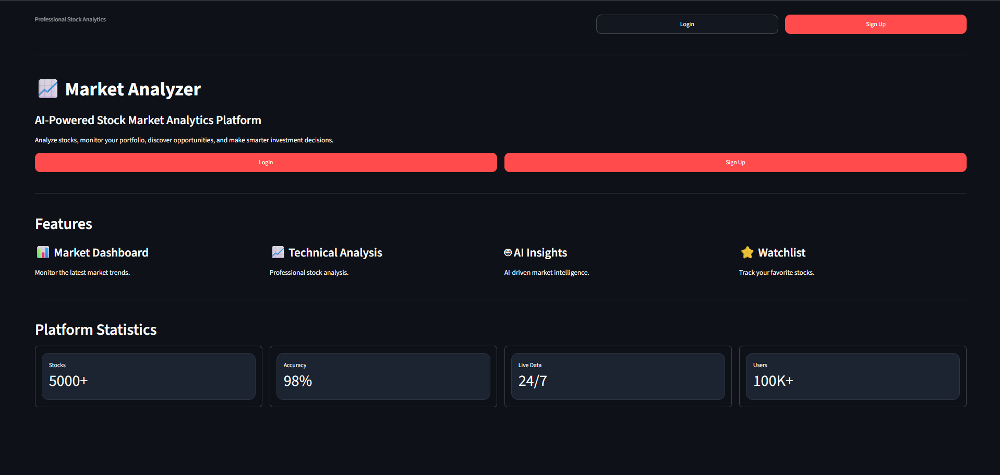
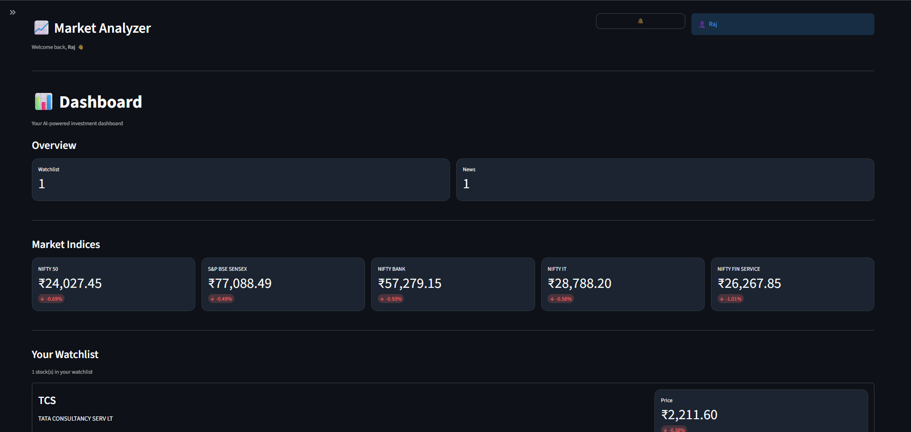
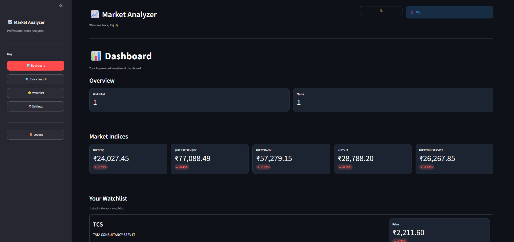
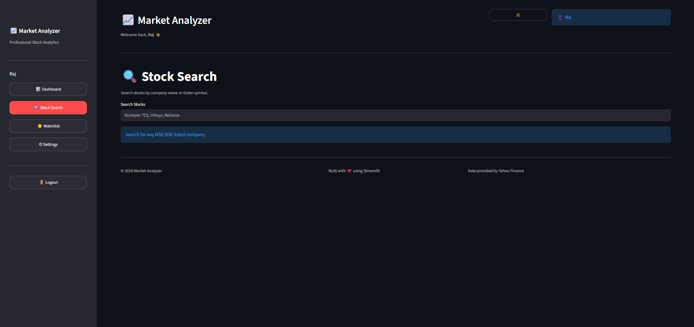
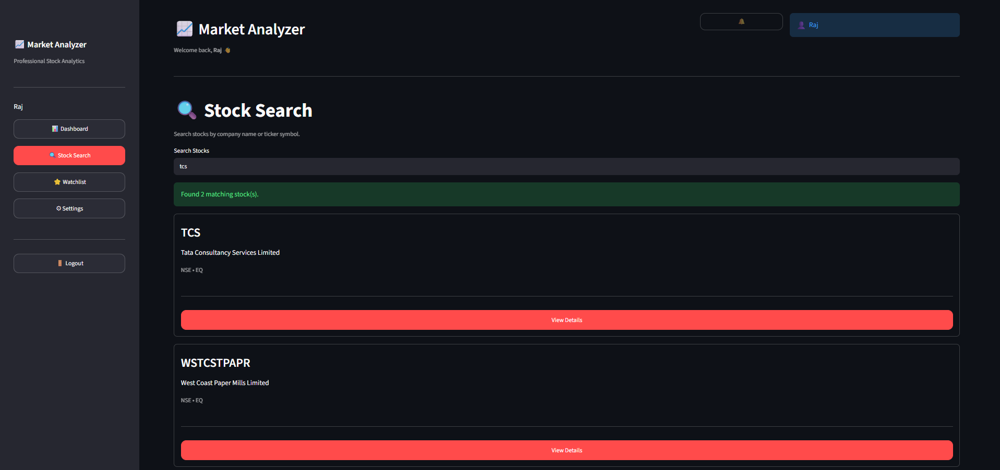
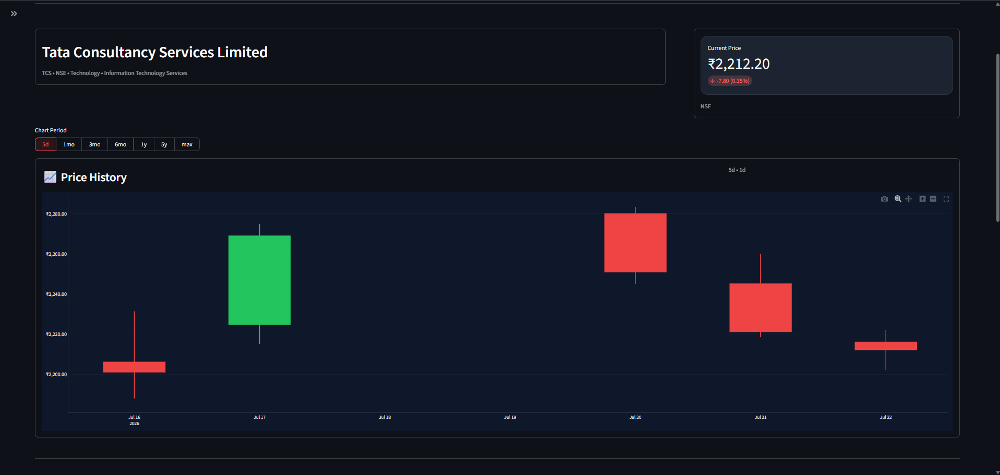
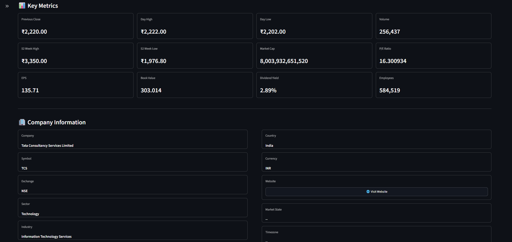
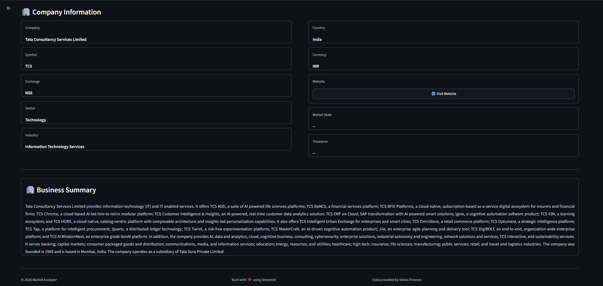
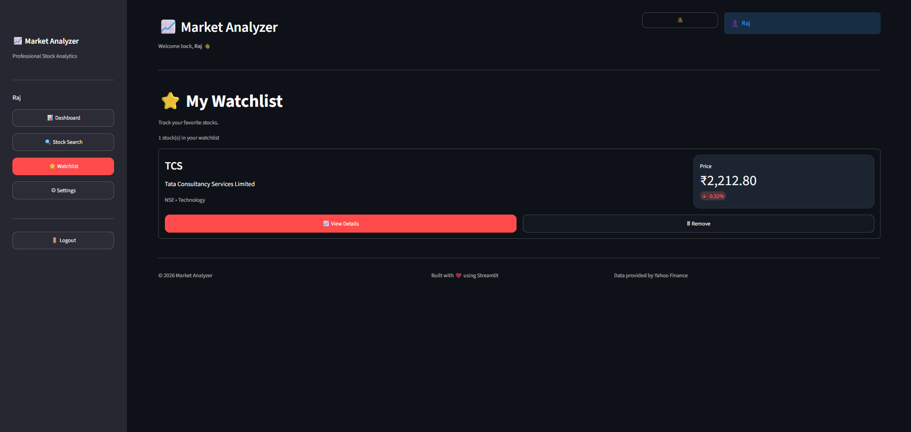
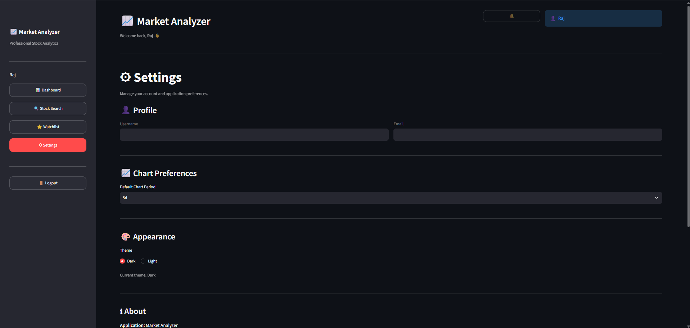

# 📈 Market Analyzer

A production-ready full-stack stock market analytics platform built using **FastAPI**, **Streamlit**, and **PostgreSQL**.

The application enables users to search stocks, analyze historical price movements, monitor technical indicators, manage personalized watchlists, and visualize market data through an interactive dashboard.

---

## Features

- JWT Authentication
- Secure User Registration & Login
- Dashboard with Market Overview
- Stock Search
- Detailed Stock Information
- Historical Price Charts
- Technical Indicators
- Personal Watchlist
- Company Information
- Responsive Streamlit UI
- PostgreSQL Database
- REST API using FastAPI

---

## Application Screenshots

### 🔑 Authentication & Entry

Onboarding interface for user authentication:

<p align="center">
  
</p>

### 📊 Interactive Dashboard

Market overview metrics and comprehensive analytical trends:

<p align="center">
  
  <br><br>
  
</p>

### 🔍 Stock Search & Discovery

Finding assets and reviewing matches within the framework:

<p align="center">
  
  <br><br>
  
</p>

### 📈 Stock Details & Analytics

Deep dives into charts, metrics, and parameters:

<p align="center">
  
  <br><br>
  
  <br><br>
  
</p>

### ⭐ Watchlist & Settings

Tracking asset metrics and managing user context parameters:

<p align="center">
  
  <br><br>
  
</p>

## Technology Stack

### Backend

- FastAPI
- PostgreSQL
- psycopg2
- JWT Authentication
- Passlib (bcrypt)
- Pydantic
- yfinance

### Frontend

- Streamlit
- Plotly
- Pandas
- Requests

---

## Project Structure

```text
Market-Analyzer/

app/
streamlit-app/
scripts/
tests/
README.md
```

---

## REST APIs

### Authentication

| Method | Endpoint           |
| ------ | ------------------ |
| POST   | `/sma/v1/signup` |
| POST   | `/sma/v1/login`  |
| GET    | `/sma/v1/me`     |

### Dashboard

| Method | Endpoint              |
| ------ | --------------------- |
| GET    | `/sma/v1/dashboard` |

### Search

| Method | Endpoint           |
| ------ | ------------------ |
| GET    | `/sma/v1/search` |

### Stocks

| Method | Endpoint                        |
| ------ | ------------------------------- |
| GET    | `/sma/v1/stocks/{symbol}`     |
| GET    | `/sma/v1/{symbol}/history`    |
| GET    | `/sma/v1/{symbol}/indicators` |

### Watchlist

| Method | Endpoint                |
| ------ | ----------------------- |
| GET    | `/watchlist`          |
| POST   | `/watchlist`          |
| DELETE | `/watchlist/{symbol}` |

---

## Installation

Clone the repository

```bash
git clone https://github.com/<username>/Market-Analyzer.git
```

```bash

pip install requirements.txt

Backend

```bash

uvicorn app.main:app --reload
```

Frontend

```bash
cd streamlit-app

streamlit run app.py
```

## Future Improvements

- Portfolio Tracking
- AI Stock Insights
- Email Alerts
- Real-time Streaming
- News Sentiment Analysis
- Price Prediction Models

---

## License

MIT License
